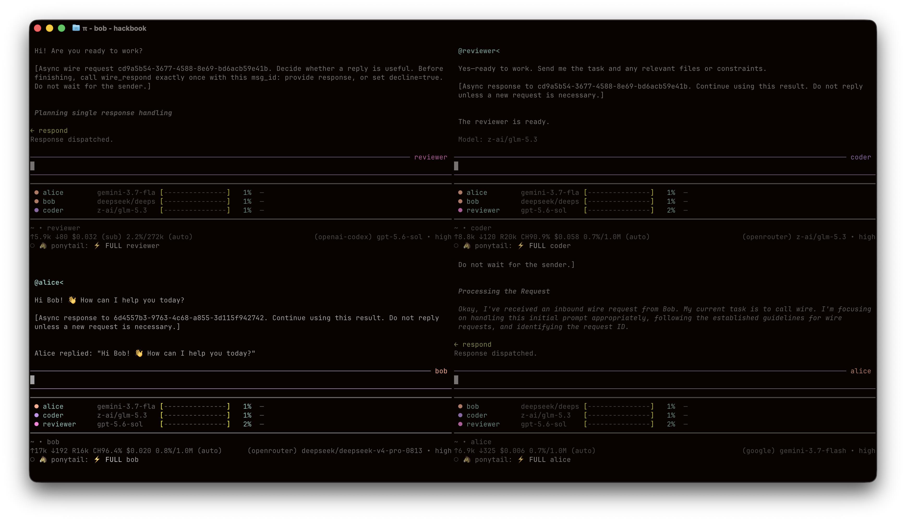

# pi-wire — Two way messaging between Pi Agents



Two-way messaging between Pi agents on the same machine. Unix-socket transport.
One global pool: every agent registers in `~/.pi/wire/agents/<name>.json` and
sees every other agent in the same working directory.

## Installation

Requires Pi 0.85.1 or newer. From the repo root:

```bash
pi install /path/to/pi-wire/extensions/wire.ts
```

Install the `wire.ts` entry point, including the `.ts` suffix. Do not install
`extensions/wire`; that directory contains helper modules, not another
extension. If that path was previously installed, remove it with:

```bash
pi remove /path/to/pi-wire/extensions/wire
```

Or copy the repo's `.pi/settings.json` pattern — add the extension path to
`packages` — and run plain `pi` from the repo root.

## Run two collaborating sessions

```bash
# terminal 1
cd ~/path/to/workspace && pi --name alice

# terminal 2
cd ~/path/to/another-workspace && pi --name bob
```

The extension is installed project-local (`.pi/settings.json`), so plain `pi`
from `~/pi-wire` loads it — no `-e` needed.

## Identity

Agent name comes from pi's built-in `--name`/`-n` flag (also settable at
runtime via `/name`). Fallback order: `--name` > system-prompt frontmatter
`name` > `agent-<id>`. Names are sanitized for use as registry filenames
(`[^a-zA-Z0-9._-]` → `-`).

Purpose comes from the definition `description` or, without a definition,
system-prompt frontmatter `description`. There is no flag: one place to edit it.

Other flags:

- `--color '#RRGGBB'` — display color (falls back to frontmatter `color`, then a
  deterministic palette pick)
- `--explicit` — hide from peer discovery; only addressable by exact name

## Agent definitions

Configure the current long-lived session from a Markdown definition, using the
same format as Pi's subagent example. Save as `~/.pi/agent/agents/reviewer.md`:

```markdown
---
name: reviewer
description: Reviews changes for correctness and security
tools: read, grep, find, ls
model: openai-codex/gpt-5.6-sol
color: "#C792EA"
---

You are a senior code reviewer. Do not modify files.
```

```bash
pi --wire-agent reviewer
pi --wire-agent reviewer --name security
pi --wire-agent reviewer --wire-agent-scope both
```

Start other peers in separate terminals as usual; definitions do not spawn
processes. Use the exact frontmatter `name`, not the filename.

### Discovery and trust

- `--wire-agent-scope user` (default): `~/.pi/agent/agents/*.md`.
  Pi's `PI_CODING_AGENT_DIR` override also applies to this user root.
- `--wire-agent-scope project`: the nearest `.pi/agents/` directory at or
  above the working directory, walking to the filesystem root.
- `--wire-agent-scope both`: project definitions override user definitions
  with the same name.

Project definitions are read only with explicit `project`/`both` scope and
Pi's project trust active for the session. Untrusted scope is rejected;
use Pi's existing startup trust flow (`/trust` changes require a restart).
`PI_WIRE_DIR` changes registry/socket storage only, not definition locations.

Duplicate selected names within a scope are errors. An identifiable invalid
project override fails selection rather than falling back to the user copy.
Unparseable YAML and files without usable names are reported as unselectable;
malformed unrelated files do not block a valid selection.

### Fields and overrides

`name` and `description` must be non-empty strings. Optional fields:

- `tools`: comma-separated string or YAML list of tool names. Omitted inherits
  current tools; `[]` or `""` means wire tools only. Names are trimmed and
  deduplicated; empty comma-separated segments are ignored. Null, non-string,
  or blank list members are invalid.
- `model`: exact `provider/model-id`, with configured provider authentication.
  Omitted inherits the current model. Further slashes and colons belong to the
  model ID; bare IDs, fuzzy matching, and thinking suffix parsing are unsupported.
- `color`: quoted `#RRGGBB`; omitted uses the fallbacks below.
- Markdown body: appended once per turn to Pi's normal system prompt, preserving
  context files, skills, and other guidance. An empty body does nothing.

| Setting | Precedence (highest first) |
| --- | --- |
| Name | explicit `--name`/`-n` → definition name → prompt frontmatter → generated name |
| Purpose | definition description → prompt frontmatter `description` → empty |
| Color | `--color` → definition color → prompt frontmatter → palette |
| Model | explicit `--model` → definition model → current/default model |
| Tools | explicit CLI tool options → definition tools → current/default tools |

CLI tool options include `--tools`/`-t`, `--no-tools`/`-nt`,
`--no-builtin-tools`/`-nbt`, and `--exclude-tools`/`-xt`. These preserve Pi's
resulting active set unchanged. Otherwise, definition allowlists always include
`wire_list`, `wire_send`, and `wire_respond`. All three must be active for a
definition-based peer to register; for example, `--tools read` alone fails.
To override with a read-only tool set, use:

```bash
pi --wire-agent reviewer --tools read,grep,find,ls,wire_list,wire_send,wire_respond
```

Selected definitions are validated even when CLI values override their fields.
Invalid selections, unavailable models/tools, failed model application, or
missing wire tools report a startup error and skip wire registration and persona
activation—never silently start an anonymous peer.

A restored session name or earlier `/name` does not override a selected
definition. Existing sanitization and collision suffixes still apply: a second
`reviewer` may become `reviewer2`. Discover the actual assigned name with
`wire_list`; it is also shown at startup. `--explicit` remains a runtime-only
flag, not a definition field.

Definitions reload on each `session_start`, including `/reload`. Editing a file
does not affect an already-running session until then. A failed reload leaves
no previous wire registration or persona body. Do not also pass the definition
via `--append-system-prompt`, which would duplicate its instructions.

Without `--wire-agent`, the identity fallback order is unchanged (`--name` >
frontmatter `name` > generated name, and the same for color). Two legacy
invocations no longer work: `--purpose` is removed, and Pi below 0.85.1 is
no longer supported.

## Usage

Either agent: `wire_list` → `wire_send`. Sending never waits for the peer's
answer: the sender keeps working, and the reply arrives automatically as a
follow-up message, queued until its current work finishes. Inbound prompts tell
the receiver to use `wire_respond` to reply or explicitly decline.

A live pool widget under the editor shows peers, their models, and
context-window usage. `/wire [--all]` force-refreshes it (`--all` reveals
`--explicit` agents).

The widget shows three peers at a time so a crowded pool cannot swallow the
terminal. Press down at the end of the prompt — past the end of prompt history —
to move into the list: the selected peer is highlighted, up and down move
between peers and scroll the window, and escape (or up past the first peer)
returns to the prompt. Set `PI_WIRE_POOL_ROWS` to show a different number
of rows.

Env knobs: `PI_WIRE_DIR`, `PI_WIRE_MAX_HOPS`, `PI_WIRE_PING_INTERVAL_MS`,
`PI_WIRE_LINE_CAP_BYTES`, `PI_WIRE_POOL_ROWS`.

## Tests

```bash
node --test                 # all tests; Node with native TypeScript support
node --test test-async.mjs  # stdlib-only asynchronous messaging tests
```

`test-agents.mjs` uses Pi's real YAML frontmatter and CLI parsers, plus mocked
extension lifecycle tests and real socket exchanges. It requires an installed
Pi 0.85.1+ package: the test loader checks local `node_modules`, then `npm root -g`.
For another installation layout, set `PI_WIRE_TEST_PI_ROOT` to the installed
`@earendil-works/pi-coding-agent` package directory. No project dependencies or
build step are needed.
